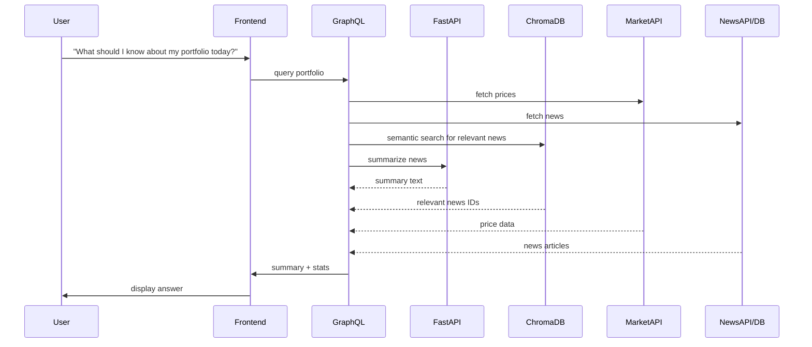

# Portfolio Summary Sequence Diagram

This diagram shows the technical flow for answering "What should I know about my portfolio today?" using GraphQL (Node.js server), semantic search, and summarization.

