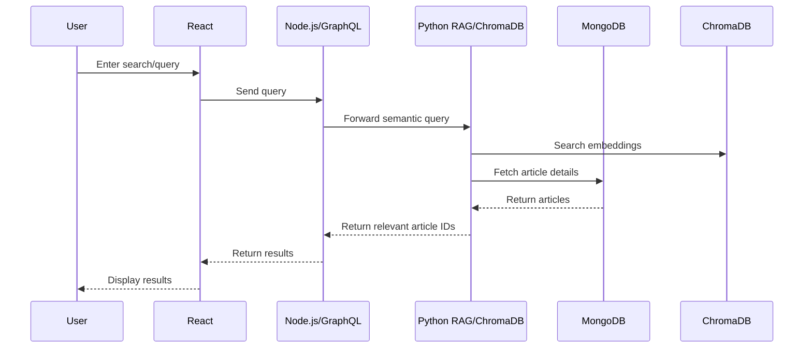

# Semantic Search Sequence Diagram

This diagram shows the technical flow for a semantic search from user input to result display, matching the provided image.

```mermaid
sequenceDiagram
  participant User
  participant React
  participant Node.js/GraphQL
  participant Python RAG/ChromaDB
  participant MongoDB
  participant ChromaDB

  User->>React: Enter search/query
  React->>Node.js/GraphQL: Send query
  Node.js/GraphQL->>Python RAG/ChromaDB: Forward semantic query
  Python RAG/ChromaDB->>ChromaDB: Search embeddings
  Python RAG/ChromaDB->>MongoDB: Fetch article details
  MongoDB-->>Python RAG/ChromaDB: Return articles
  Python RAG/ChromaDB-->>Node.js/GraphQL: Return relevant article IDs
  Node.js/GraphQL-->>React: Return results
  React-->>User: Display results
``` 